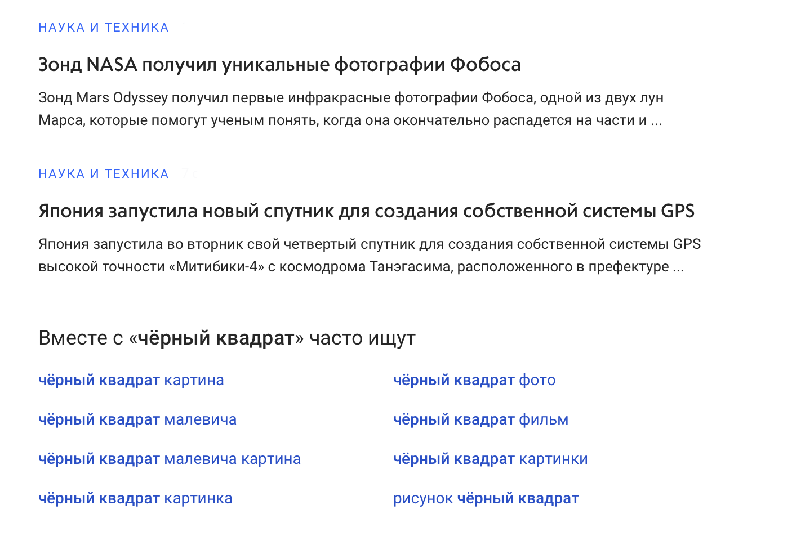

# NodeJS test task

Test task execution module.

## Task 

Write a NodeJS server, which functions as follows:
- It pulls data from 2 sources: news (important) and phrases (unimportant)
- We can wait up to 6 seconds for a response from the ***important*** source. If we don't get a response in 6 seconds, the "News timeout..." message should be shown.
- We can wait the ***unimportant*** source until the ***important*** data is received. If we got the ***important***  data and ***unimportant*** data is still fetching, the "Phrases timeout..." message should be shown.
- You can use any template engine
- You don't eed to write JS in browser
- Pixel-prefect design is not required
- We should be able to start server with the ```npm i && npm run start``` command. And it should available at http://localhost:3000

## Data sources
- News: http://slowpoke.desigens.com/json/1/7000 
- Phrases: http://slowpoke.desigens.com/json/2/3000

## Design


